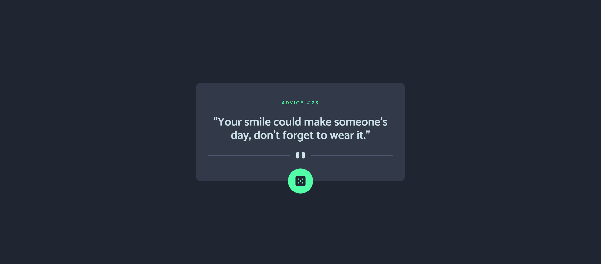

<h1 align="center">Advice Generator App</h1>

This is my solution for the advice generator app from Frontend Mentor

Summary
===========
<!--ts-->
  * [About](#about)
  * [Screenshot](#screenshot)
  * [How to use](#how-to-use)
  * [Status](#status)
  * [Features](#features)
  * [Technologies](#technologies)
  * [Author](#author)
<!--te-->

About
-----

This is a simple app that shows you different advices. It is connected to Advices Lip API.

It was a simple project and I concluded in less than a day, it's cool to make an API connection!

Screenshot
----------

How to use
----------

You can see the project clicking <a href="https://advice-generator-app-orpin.vercel.app/">here</a>.

It will start alredy giving you a advice and you can click at the button to change for another random advice.

Status
------
Concluded :heavy_check_mark:

Features
--------
- [x] See random advices

Technologies
------------

  
  
  
  

Author
------
<h3 align="center">Rafael Tavares</h3>

 <a href="https://www.facebook.com/rafael.tavares.39904/"></img></a>
 <a href="https://www.instagram.com/rafatavares03/"></img></a>

